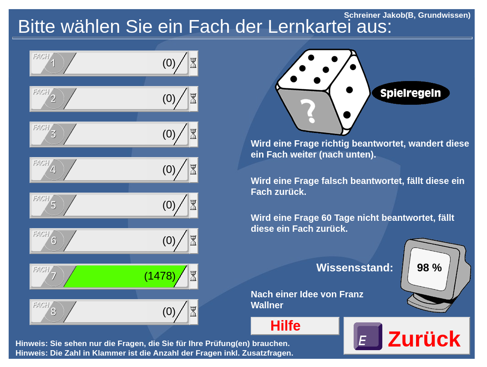
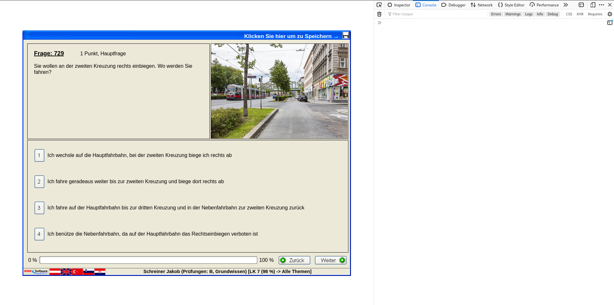
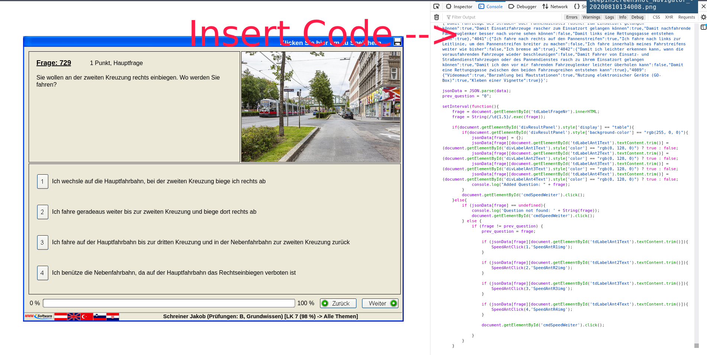

# MMMTest Bot

Ein bot für die  [mmmtest](https://www.mmmtest.at) Fahrschul lern Software.
Er kann alle frage von B Grund und Spezialwissen. 
Mann kann aber mit der bot_lerning.js dem bot auch noch andere Fragen beibringen.

---

## Setup

* Logge dich in deinen MMM-test Account ein und gehe zu dem Fach das du lernen willst.
* Öffne die Console in deinem Browser und füge mit copy/past den code von bot.js ein.
* enjoy ;)

Du musst für jedes fach den Code neu einfügen.

## Lerning

Um neue Fragen zu lernen, verwende die `bot_learing.js`. Am Ende wird dir ein Fenster mit dem neu generiertem Code ausgegeben.

# LICENCE

mmmtest_bot is released under "THE BEER-WARE LICENSE", see `LICENSE` for details.
